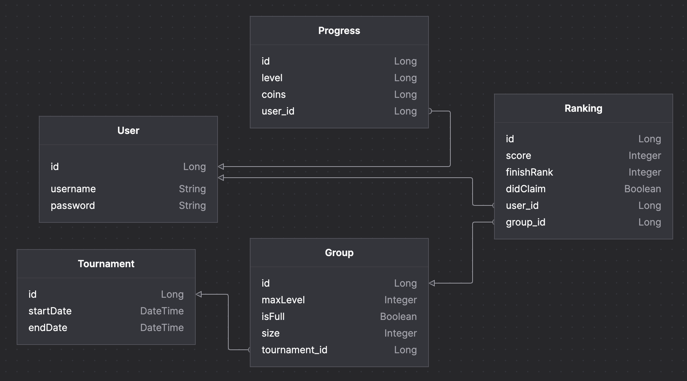

# Rowmatch
DB Diagram (MYSQL is used):

Endpoints:
- "/api/v1/users/create"
- "/api/v1/users/authenticate"
- "/api/v1/users/progress"
- "/api/v1/tournaments/enter"
- "/api/v1/tournaments/rank"
- "/api/v1/tournaments/claim"
- "/api/v1/tournaments/leaderboard"

Security:
- Use JWT for all request (except create, authenticate)

Real-Time Leaderboard:
- Redis Sorted Set is used

Tournament Start & End:
- Cron is used

### Emre HORSANALI

